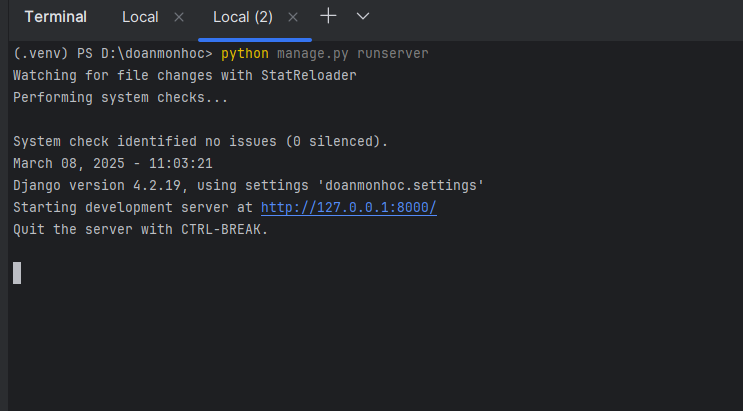

# doanmonhoc
bước 1: tạo project với Django trên Pycharm 
bước 2: tải các thư viện hỗ trợ 
    $ pip install underthesea 
    $ pip install pymysql 
bước 3: mở server trên Pycharm 
    cd đến thư mục chứa manage.py 
    $ python manage.py runserver 
 
bước 4: truy cập vào trình duyệt và gõ địa chỉ http://127.0.0.1:8000/ 
